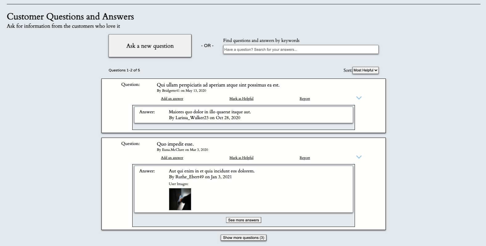

# CREAM
## Improvements to an inherited e-commerce fashion retail web application

[Link to the original repo](https://github.com/The-Backers/FEC)

# Improvements

## Addition of a Questions and Answers section

This section allows asking and answering of questions for a selected product. The functionality contained within this section can be divided into several pieces:
- View questions
- Search for a question
- Asking a question
- Answering a question

### View Questions

### Search for a Question

### Asking a Question

### Answering a Question

---
## Formatting and Stylistic changes
---

### Old

### New

