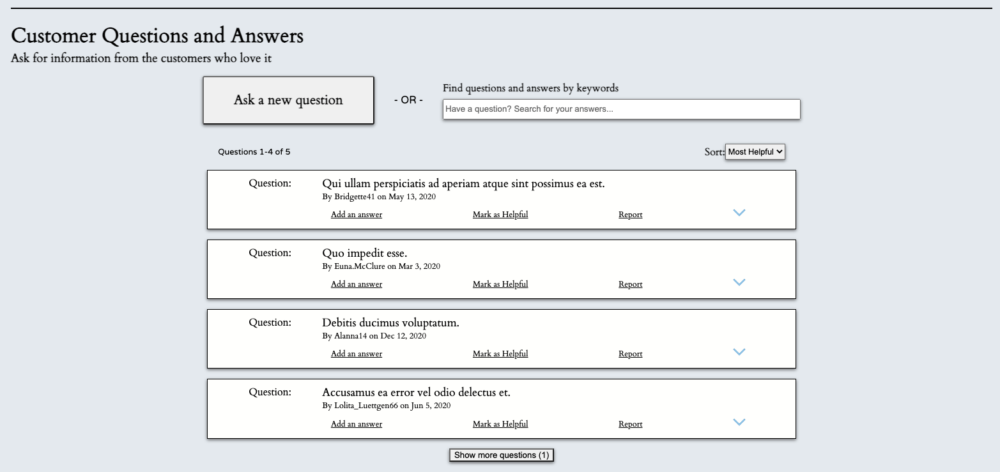
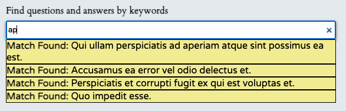
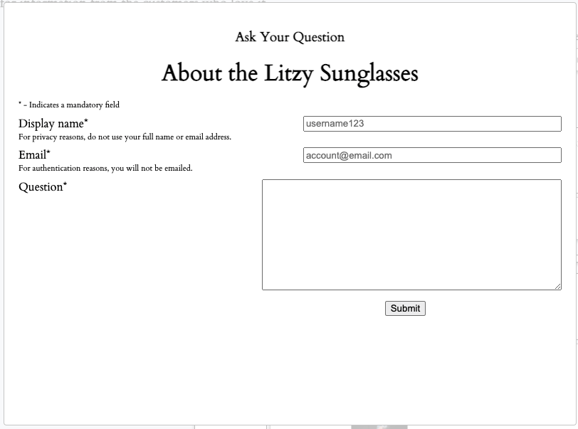
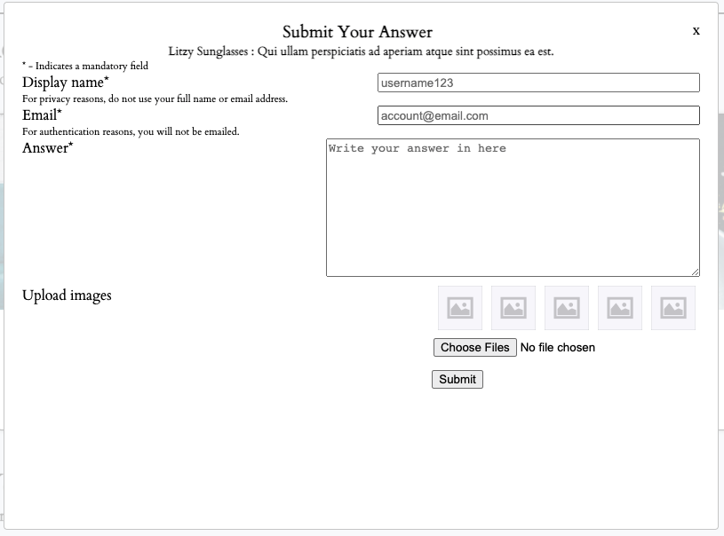
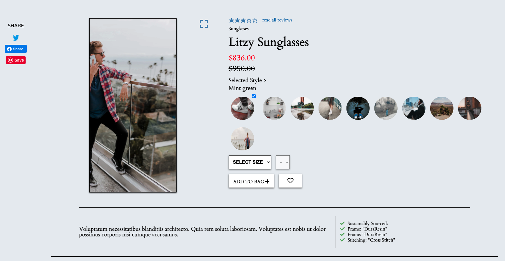
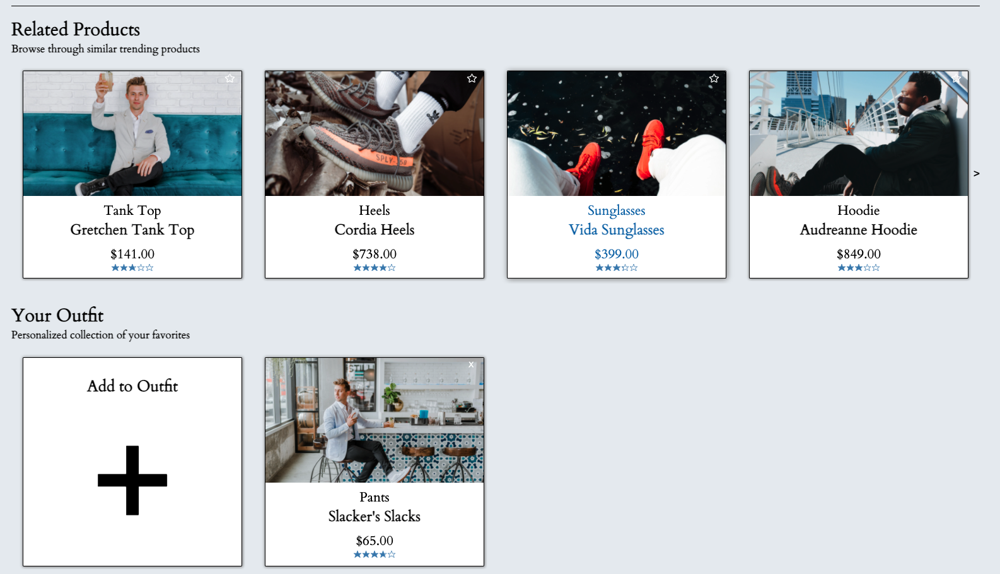
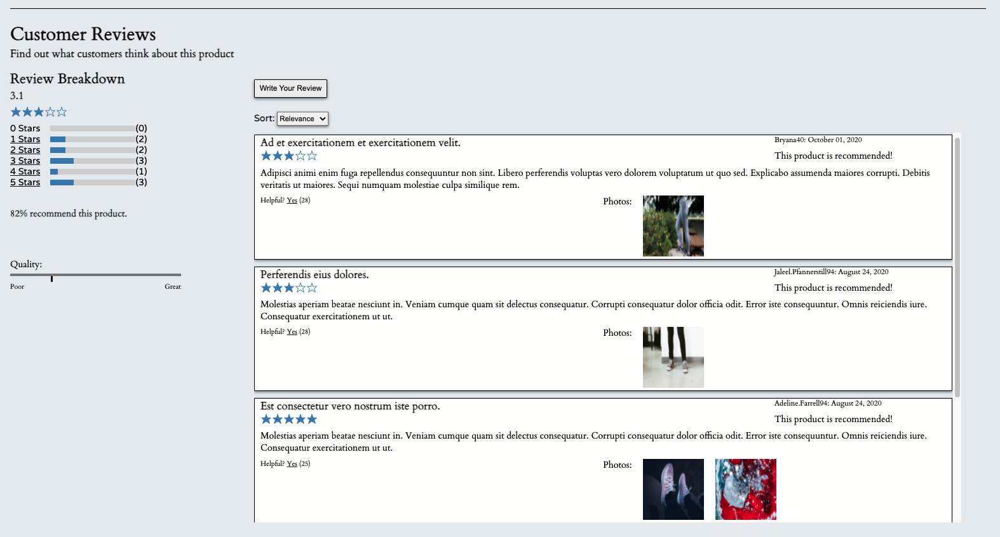

# CREAM
## Overview
The challenge of this project was to improve upon the front end of an existing web app. This involved two main processes:
1. Adding a new Questions and Answers section with a number of features
2. Cosmetic refinements throughout the entire app

### Links
- [Improved web app](http://18.225.11.209:3000/#11109)
- [Original web app](https://github.com/The-Backers/FEC) (Credit to the Backers for their inital work on the web app)

## Technologies Featured
- Javascript
- HTML / CSS
- React
- Redux
- Axios

## Improvements

### #1 - Addition of a Questions and Answers section
This section allows asking and answering of questions for a selected product. The functionality contained within this section was divided into the following:
- View questions and answers
- Search for a question
- Asking a question
- Answering a question

### View Questions
The primary feature of this section is the ability to view previously asked questions for a selected product. The related functionalities include:
- Questions and corresponding answers presented within an expandable and collapsible accordion
- Pagination with a default view of 2 questions on page load, if available (default view of 1 answer)
- Button to display the hidden additional questions and collapse questions (same for answers)
- 'Mark as Helpful' and 'Report' buttons for questions
- Button that toggles on/off all of the answers related to a specific question (default is on)
- Tags the username of the poster and the date of the post (same for answers)

### Search for a Question
Users have the ability to search for keywords before they browse through existing questions or submit a new one. This feature is a fuzzy search that is less stringent and enables search results to include approximate matches.

### Asking a Question
Near the top of the section, a 'Ask a new question' button is positioned to grab a user's attention. Upon click, this button triggers a modal window with a form that users can fill out with questions they want to submit. 

### Answering a Question
Within each question card, a 'Add an answer' button is positioned inline with the 'Mark as Helpful' and 'Report' buttons. Upon click, this button triggers a modal window with a form that users can respond with. While similar to the question modal form, this form has the additional feature of allowing users to upload up to 5 images.

### #2 - Cosmetic refinements
In addition to adding a brand new section, the goal of this project was to touch up the inherited web app into a more cohesive, consistent and visually alluring product for a better user experience. This meant that the primary focus involved making sweeping cosmetic changes where necessary. Much of the work involved heavy usage of the various CSS techniques such as CSS box model, flex and grid. There was a minimal amount of code refactoring and the functionality of the original sections largely remain untouched.

